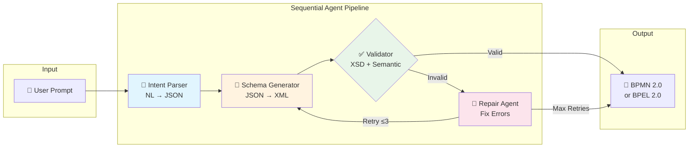

# AI-Assisted Workflow Authoring

[](https://github.com/ericchansen/ai-xml/actions/workflows/ci.yml)

Transform natural language descriptions into valid **BPMN 2.0** or **WS-BPEL 2.0** XML using a sequential agent pipeline with iterative validation and repair.

## 🚀 Quick Start

```bash
# Prerequisites: uv (https://docs.astral.sh/uv/), Azure CLI
# Install uv: curl -LsSf https://astral.sh/uv/install.sh | sh

# 1. Clone and enter directory
cd ai-xml

# 2. Configure Azure OpenAI (copy and edit)
cp .env.example .env
# Edit .env with your Azure OpenAI endpoint

# 3. Login to Azure
az login

# 4. Run the app
uv run streamlit run app.py
```

That's it! `uv` automatically creates a virtual environment and installs all dependencies.

## 🧪 Running Tests

```bash
# Run all tests
uv run --group dev pytest tests/ -v

# Run specific test file
uv run --group dev pytest tests/test_validation.py -v

# Run with coverage (if installed)
uv run --group dev pytest tests/ --cov=src
```

## 🎯 Problem Statement

Enterprise integration platforms require deep platform expertise to author integrations. Users must translate business scenarios into detailed process graphs and XML definitions through manual, error-prone steps. LLMs lack native understanding of custom XML grammars and semantic constraints.

**Solution:** An AI-assisted authoring approach that bridges business intent to valid workflow artifacts, preserving correctness, debuggability, and human control through validation and iterative correction.

## 🏗️ Architecture

This project implements the **Sequential Orchestration Pattern** from [Microsoft's AI Agent Design Patterns](https://learn.microsoft.com/en-us/agent-framework/user-guide/workflows/orchestrations/sequential):



### Pipeline Stages

1. **Intent Parser** - Converts natural language to structured JSON workflow spec
2. **Schema Generator** - Transforms JSON to BPMN 2.0 or WS-BPEL 2.0 XML
3. **Validator** - XSD validation + semantic checks (reachability, completeness)
4. **Repair Agent** - LLM-driven iterative error correction (max 3 attempts)

## ⚙️ Configuration

Copy `.env.example` to `.env` and configure:

```bash
# Azure OpenAI (recommended)
AZURE_OPENAI_ENDPOINT=https://your-resource.cognitiveservices.azure.com/
AZURE_OPENAI_DEPLOYMENT_NAME=gpt-4o-mini
AZURE_OPENAI_API_VERSION=2024-12-01-preview
```

Authentication uses `DefaultAzureCredential` - just run `az login` before starting the app.

## 📁 Project Structure

```
ai-xml/
├── app.py                      # Streamlit demo UI
├── pyproject.toml              # Project metadata and dependencies
├── .env.example                # Environment variable template
├── src/
│   ├── __init__.py
│   ├── models.py               # Pydantic models for workflow representation
│   ├── prompts.py              # Agent system prompts
│   ├── validation.py           # XML validation utilities (lxml)
│   ├── pipeline.py             # Microsoft Agent Framework pipeline
│   └── langgraph_pipeline.py   # LangGraph comparison implementation
├── schemas/
│   ├── bpmn20-simplified.xsd   # BPMN 2.0 schema for validation
│   └── bpel20-simplified.xsd   # WS-BPEL 2.0 schema for validation
└── examples/
    ├── order-processing.bpmn   # Example BPMN output
    └── order-processing.bpel   # Example BPEL output
```

## 🔧 Key Design Decisions

### 1. Intermediate JSON Representation

Instead of generating XML directly from natural language, we use a simplified JSON schema:

```json
{
  "workflow": {
    "name": "OrderProcessing",
    "activities": [
      {"id": "start", "type": "startEvent"},
      {"id": "validateOrder", "type": "serviceTask", "operation": "validateOrder"},
      {"id": "end", "type": "endEvent"}
    ],
    "flows": [
      {"from": "start", "to": "validateOrder"},
      {"from": "validateOrder", "to": "end"}
    ]
  }
}
```

**Benefits:**
- Reduces LLM hallucination
- Easier to validate before XML generation
- Decouples intent understanding from XML syntax

### 2. Iterative Validation & Repair

- XSD validation catches structural errors
- Semantic validation checks workflow correctness (reachability, completeness)
- Repair loop limited to 3 iterations to prevent infinite loops
- Errors surfaced to user if repair fails

### 3. Human-in-the-Loop

- All intermediate steps visible in the UI
- Users can download and manually edit results
- Clear error messages with suggested fixes

## 📊 Framework Comparison

| Aspect | Microsoft Agent Framework | LangGraph |
|--------|--------------------------|-----------|
| State | Pydantic models | TypedDict |
| Control flow | Manual loops | Graph edges |
| Backend | Azure AI, GitHub Copilot | OpenAI/Anthropic |
| Enterprise | Azure integration | General purpose |

See `src/langgraph_pipeline.py` for the LangGraph implementation.

## 📚 References

- [AI Agent Orchestration Patterns (Microsoft)](https://learn.microsoft.com/en-us/azure/architecture/ai-ml/guide/ai-agent-design-patterns)
- [Microsoft Agent Framework Quick-Start](https://learn.microsoft.com/en-us/agent-framework/tutorials/quick-start)
- [GitHub Copilot Agents](https://learn.microsoft.com/en-us/agent-framework/user-guide/agents/agent-types/github-copilot-agent)
- [BPMN 2.0 Specification](https://www.omg.org/spec/BPMN/2.0/)
- [WS-BPEL 2.0 Specification](https://docs.oasis-open.org/wsbpel/2.0/wsbpel-v2.0.html)

### Related Academic Work
- [arXiv:2509.24592](https://arxiv.org/abs/2509.24592) - AI-assisted workflow generation
- [Springer Chapter](https://link.springer.com/chapter/10.1007/978-3-031-81375-7_27) - Hybrid workflow authoring
- [CEUR-WS Paper](https://ceur-ws.org/Vol-4099/ER25_PAD_Costa.pdf) - Iterative validation patterns
- [gpt-codegen](https://github.com/RobJenks/gpt-codegen) - LLM code generation patterns

## 📝 License

MIT
