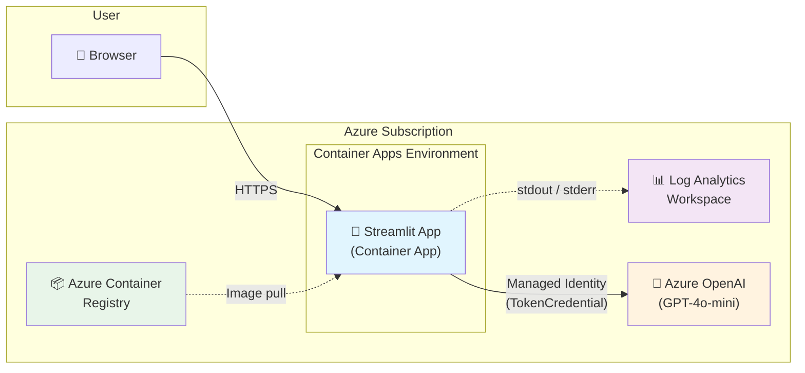
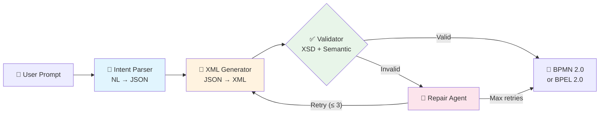
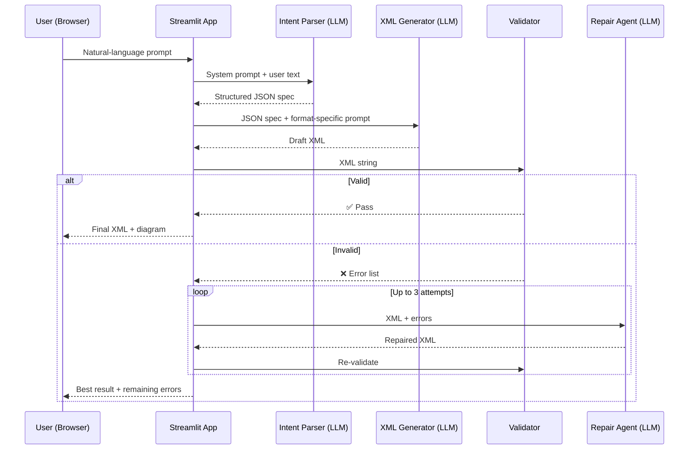
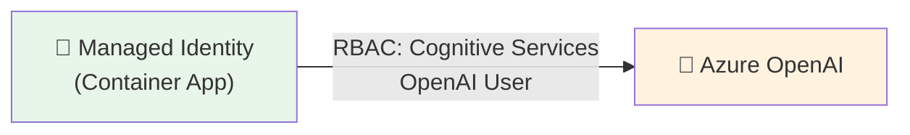

# How It Works — Backend Architecture

AI-Assisted Workflow Authoring transforms plain-English process descriptions
into standards-compliant **BPMN 2.0** or **WS-BPEL 2.0** XML. It combines
large-language-model generation with deterministic validation and automated
repair so that the output is structurally correct and semantically sound —
without requiring deep XML or workflow-specification expertise from the user.

This document explains what happens behind the scenes: the agent pipeline that
powers generation, the Azure infrastructure that hosts it, and the security
model that ties everything together.

---

## 1. Architecture Overview

The system is a containerised Python application deployed to **Azure Container
Apps**. It calls **Azure OpenAI** for LLM inference and uses a system-assigned
**managed identity** for authentication — no API keys are stored in code or
configuration.



| Component | Purpose |
|-----------|---------|
| **Container App** | Hosts the Streamlit web application; scales 0 – 3 replicas based on HTTP traffic |
| **Azure OpenAI** | Provides GPT-4o-mini (or equivalent) for intent parsing, XML generation, and repair |
| **Container Registry** | Stores the Docker image built during deployment |
| **Log Analytics** | Collects application and platform logs for monitoring |

---

## 2. The Agent Pipeline

Generation follows a **sequential orchestration pattern** — each stage
completes before the next begins, and every stage has a well-defined input and
output. This pattern is drawn from
[Microsoft's AI Agent Design Patterns](https://learn.microsoft.com/en-us/agent-framework/user-guide/workflows/orchestrations/sequential).



### Stage 1 — Intent Parsing (LLM)

The user's natural-language description is sent to Azure OpenAI with a system
prompt that instructs the model to extract a **structured JSON workflow
specification**. The schema covers activities (start/end events, service tasks,
user tasks, gateways), sequence flows, variables, and partner links.

Producing JSON first — rather than XML directly — reduces hallucination and
lets the system validate structure before any XML is generated.

### Stage 2 — XML Generation (LLM)

The validated JSON specification is passed to a second LLM call whose system
prompt is specific to the target format (BPMN 2.0 or WS-BPEL 2.0). The model
generates a complete XML document following the relevant standard, including
namespaces, element nesting, and cross-references (e.g., `<incoming>` /
`<outgoing>` elements referencing sequence-flow IDs).

### Stage 3 — Validation (Deterministic)

This stage does **not** use an LLM. It runs two deterministic checks:

| Check | What it catches |
|-------|-----------------|
| **XSD schema validation** | Structural errors — missing elements, wrong nesting, namespace issues |
| **Semantic validation** | Workflow-logic errors — missing start/end events, unreachable activities, dangling flows, gateway mismatches |

Because validation is deterministic, it is fast, reproducible, and does not
consume LLM tokens.

### Stage 4 — Repair Loop (LLM, conditional)

If validation fails, the draft XML and the list of errors are sent to a repair
agent. The repaired XML is fed back through validation. This loop runs up to
**three times**. If validation still fails after three attempts, the best-effort
result is returned to the user along with the remaining errors.

The bounded retry limit prevents runaway LLM costs and ensures the pipeline
always terminates.

---

## 3. Data Flow

The diagram below shows the end-to-end flow of data through the system for a
single generation request.



**Key points:**

- **No data is persisted server-side.** The user's prompt and the generated
  artifacts exist only in the browser session. Nothing is written to a database
  or stored beyond the current session.
- **LLM calls use Azure OpenAI**, which inherits your organisation's Azure
  data-residency and compliance posture.
- **All intermediate outputs** (JSON spec, draft XML, validation results) are
  surfaced in the UI so the user can inspect and download at every stage.

---

## 4. Azure Infrastructure

The entire stack is defined as **Infrastructure as Code** using
[Bicep](https://learn.microsoft.com/en-us/azure/azure-resource-manager/bicep/overview)
and deployed with a single command via the
[Azure Developer CLI (`azd`)](https://learn.microsoft.com/en-us/azure/developer/azure-developer-cli/overview).

### What gets deployed

| Resource | SKU / Tier | Role |
|----------|-----------|------|
| **Azure Container Apps** | Consumption (serverless) | Runs the application; scales to zero when idle |
| **Container Apps Environment** | Managed | Provides networking, logging, and scaling infrastructure |
| **Azure Container Registry** | Basic | Stores the Docker image |
| **Log Analytics Workspace** | Per-GB (30-day retention) | Aggregates container and platform logs |
| **Azure OpenAI** *(pre-existing)* | Standard | Hosts the GPT-4o-mini deployment used by the pipeline |

### Scaling

Container Apps is configured with **HTTP-based autoscaling**:

- **Minimum replicas:** 0 (scales to zero when there is no traffic)
- **Maximum replicas:** 3
- **Scale trigger:** 10 concurrent HTTP requests per replica

This keeps costs near-zero during idle periods while handling bursts of
concurrent users.

### One-command deployment

```text
azd up
```

This single command:

1. Provisions all Azure resources via the Bicep templates in `infra/`
2. Builds the Docker image locally
3. Pushes the image to Azure Container Registry
4. Deploys the container to Azure Container Apps
5. Assigns the necessary RBAC role (see below)

---

## 5. Security & Identity

### No secrets in code

The application authenticates to Azure OpenAI using
**`DefaultAzureCredential`**, which resolves to:

| Environment | Credential used |
|-------------|----------------|
| Local development | Azure CLI login (`az login`) |
| Azure Container Apps | System-assigned managed identity |

No API keys, connection strings, or passwords are stored in application code,
environment variables, or configuration files.

### RBAC role assignment

During deployment, a post-provisioning hook automatically assigns the
**Cognitive Services OpenAI User** role to the Container App's managed
identity. This grants the application exactly the permissions it needs — and
nothing more — to call the Azure OpenAI endpoint.



### Network security

- The Streamlit front end is exposed over **HTTPS only** (TLS termination is
  handled by the Container Apps ingress).
- Azure OpenAI is accessed over the Azure backbone network using the managed
  identity token — no traffic traverses the public internet if the OpenAI
  resource is configured with a private endpoint.

---

## 6. Extensibility

The architecture is designed with pluggable extension points:

| Extension point | What you can change |
|-----------------|---------------------|
| **LLM backend** | Swap between Azure OpenAI, GitHub Copilot agents, or a mock backend for testing — selected at runtime via configuration |
| **Output format** | BPMN 2.0 and WS-BPEL 2.0 are supported today; additional formats can be added by providing a new system prompt and XSD schema |
| **Validation rules** | Custom semantic checks can be added alongside the built-in reachability and completeness analysis |
| **Deployment target** | The Docker container can run on any container host (AKS, App Service, local Docker) — Azure Container Apps is the default |

---

## 7. Design Decisions

### Why intermediate JSON?

- **Reduces LLM hallucination** — Generating structured JSON is easier for an
  LLM than generating syntactically valid XML with namespaces.
- **Easier to validate** — JSON can be validated with Pydantic before XML
  generation even starts.
- **Decouples intent from syntax** — The same JSON can produce BPMN *or* BPEL
  output, keeping the intent parser format-agnostic.

### Why iterative repair?

- LLMs don't always produce valid XML on the first try, especially for complex
  schemas with namespaces and cross-references.
- **Deterministic validation** (XSD + semantic checks) catches errors that the
  LLM cannot self-detect.
- Feeding error messages back to the LLM as repair context produces targeted
  fixes rather than full regeneration.

### Why human-in-the-loop?

- All intermediate steps (JSON spec, draft XML, validation results) are visible
  to the user.
- Users can **download and edit** the generated XML at any stage.
- Clear error messages and suggestions help users understand *what* went wrong
  and *why*.

### Why sequential orchestration?

- Each stage has **clear inputs and outputs** — easy to test and debug
  independently.
- Follows
  [Microsoft's AI Agent Design Patterns](https://learn.microsoft.com/en-us/agent-framework/user-guide/workflows/orchestrations/sequential)
  for agent orchestration.
- Simpler to reason about than graph-based or event-driven approaches; the
  linear flow matches how a human expert would approach the task.

---

## 8. References

| Resource | Link |
|----------|------|
| Microsoft AI Agent Design Patterns | [Sequential Orchestration](https://learn.microsoft.com/en-us/agent-framework/user-guide/workflows/orchestrations/sequential) |
| BPMN 2.0 Specification | [OMG BPMN 2.0](https://www.omg.org/spec/BPMN/2.0/) |
| WS-BPEL 2.0 Specification | [OASIS WS-BPEL 2.0](http://docs.oasis-open.org/wsbpel/2.0/OS/wsbpel-v2.0-OS.html) |
| Azure Container Apps | [Documentation](https://learn.microsoft.com/en-us/azure/container-apps/overview) |
| Azure Developer CLI | [Documentation](https://learn.microsoft.com/en-us/azure/developer/azure-developer-cli/overview) |
| Bicep IaC | [Documentation](https://learn.microsoft.com/en-us/azure/azure-resource-manager/bicep/overview) |
| Automated BPMN Generation from NL | [arXiv:2509.24592](https://arxiv.org/abs/2509.24592) |
| LLM-Driven Process Modelling | [Springer Chapter](https://link.springer.com/chapter/10.1007/978-3-031-70418-5_11) |
| Process Model Generation with LLMs | [CEUR-WS Paper](https://ceur-ws.org/Vol-3936/paper-11.pdf) |

---

## 9. Summary

| Concern | How it's addressed |
|---------|-------------------|
| **Correctness** | Deterministic XSD + semantic validation after every generation and repair attempt |
| **Security** | Managed identity, RBAC least-privilege, HTTPS-only, no secrets in code |
| **Cost efficiency** | Scale-to-zero Container Apps, bounded LLM retry loop (max 3), consumption-based pricing |
| **Transparency** | Every pipeline stage is visible in the UI; users can inspect and download intermediate artifacts |
| **Deployment simplicity** | Single `azd up` command deploys the full stack from Bicep IaC |
| **Standards compliance** | Generates BPMN 2.0 (OMG) and WS-BPEL 2.0 (OASIS) — industry-standard workflow formats |
